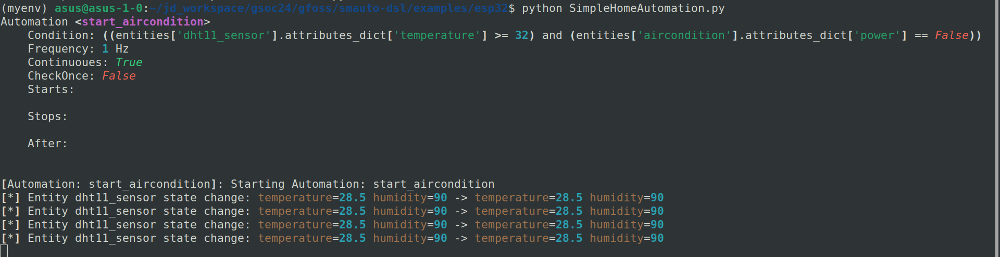
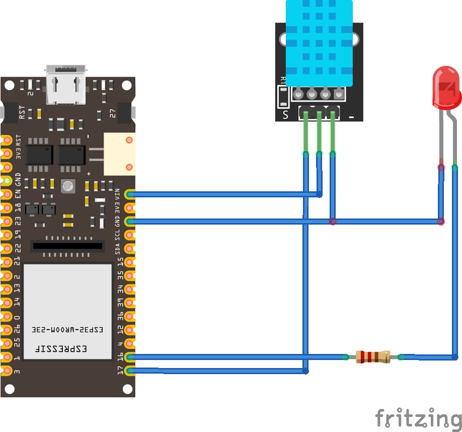

Title: SmAuto Getting Start with ESP32

Author: GohCY

Date: 18/03/2024

---

# Introduction

We're harnessing the power of SmAuto and the versatile ESP32 microcontroller, and a simple DHT11 sensor to build our very own temperature-controlled air conditioner (using an LED as a stand-in).  No complex wiring or coding experience needed - let's dive in!

# SmAuto Config & Setup

## Installation

```
git clone https://github.com/robotics-4-all/smauto-dsl
cd smauto-dsl
pip install .
```

## Local Setup

To run SmAuto locally make sure install `commlib-py` & `mosquitto MQTT  broker`

### Install Commlib-py

```
python -m venv myvenv
source myenv/bin/activate
pip install commlib-py
```

```
sudo apt update -y && sudo apt install mosquitto mosquitto-clients -y
```

### MQTT Config

Broker is working and your MQTT network is ready. In order to allow external device connect to the broker you need update the Mosquitto configuration file

```
sudo nano /etc/mosquitto/conf.d/default.conf
```

In the `/etc/mosquitto/conf.d/default.conf` file. Add the following line

```
allow_anonymous true
listener 1883
```

## Create SmAuto Model

Create `model.auto` file and add the code below

```
Metadata
    name: SimpleHomeAutomation
    version: "0.1.0"
    description: "Simple home automation model."
    author: "gohcy"
    email: "gohcy@gmail.com"
end

// Communication Brokers ------->
Broker<MQTT> home_broker
    host: "localhost"
    port: 1883
    auth:
        username: ""
        password: ""
end

Entity dht11_sensor
    type: sensor
    topic: "room.sensor"
    broker: home_broker
    attributes:
        - temperature: float
        - humidity: int
end

Entity aircondition
    type: actuator
    topic: "room.aircondition"
    broker: home_broker
    attributes:
        - power: bool
end

Automation start_aircondition
    condition: 
        (dht11_sensor.temperature >= 32) AND (aircondition.power is false)
    enabled: true
    continuous: true
    actions:
        - aircondition.power:  true
end
```

- Check the model by running `smauto validate model.auto ` is no error you will see screen print `[*] Model validation success!!`
- After that generate the python code by running `smauto gen model.auto`.
- Then a new python file `SimpleHomeAutomation.py` will be created or generated.
- To start the SmAuto run the python file `python SimpleHomeAutomation.py`
- If there is any issue or error running the python script make sure your `commlib-py` and `mosquito` broker is installed and config properly. Refer local setup.

## SmAuto Model Discussion

- Entity Definitions:
    - "dht11_sensor" (sensor) to receive data from the Arduino.
    - "aircondition" (actuator) to control the simulated air conditioner (LED).
- Automation:
    - Condition: Checks if the temperature exceeds 32°C and if the aircondition is currently off.
    - Action: Sets the "power" attribute of the "aircondition" to 'true'.

## SmAuto Running



# ESP32 Hardware Setup

## Hardware Used:
- FireBeetle 2 ESP32-E IoT Microcontroller
- LED
- DHT11 Sensor

## Circuit Schemetic Diagram




## Arduino Code

### Boards Setup

- Goes to `files` -> in `preferences`
    - Under `Additional boards manager URLs` add
    - `https://espressif.github.io/arduino-esp32/package_esp32_index.json`
- Navigate to `Board Manger`
    - Install package `esp32` by Espressif System

### Library Used

For MQTT client library we used `PubSubClient` by Nick O'Leary
https://pubsubclient.knolleary.net/

### Code

```c
#include <WiFi.h>
#include <PubSubClient.h>
#include <Wire.h>
#include <DHT.h>

// Replace the next variables with your SSID/Password combination
const char* ssid = "wifi-ssid";
const char* password = "password";

// Add your MQTT Broker IP address, example:
//const char* mqtt_server = "192.168.1.144";
const char* mqtt_server = "192.168.100.12";

WiFiClient espClient;
PubSubClient client(espClient);
long lastMsg = 0;
char msg[80];
int value = 0;

int ledPin = D11;   //Define LED pin 
int dhtPin = D10;   //Define DHT11 pin

DHT dht11(dhtPin, DHT11);

void setup(){
  Serial.begin(115200);

  setup_wifi();
  client.setServer(mqtt_server, 1883);
  client.setCallback(callback);

  pinMode(ledPin, OUTPUT);// Set ledPin as output mode
  dht11.begin();  // initialize the sensor
}

void setup_wifi() {
  delay(10);
  // We start by connecting to a WiFi network
  Serial.println();
  Serial.print("Connecting to ");
  Serial.println(ssid);

  WiFi.begin(ssid, password);

  while (WiFi.status() != WL_CONNECTED) {
    delay(500);
    Serial.print(".");
  }

  Serial.println("");
  Serial.println("WiFi connected");
  Serial.println("IP address: ");
  Serial.println(WiFi.localIP());
}

void callback(char* topic, byte* message, unsigned int length) {
  Serial.print("Message arrived on topic: ");
  Serial.print(topic);
  Serial.print(". Message: ");
  String messageTemp;
  
  for (int i = 0; i < length; i++) {
    Serial.print((char)message[i]);
    messageTemp += (char)message[i];
  }
  Serial.println();

  // Feel free to add more if statements to control more GPIOs with MQTT

  // If a message is received on the topic esp32/output, you check if the message is either "on" or "off". 
  // Changes the output state according to the message
  if (String(topic) == "room/aircondition") {
    Serial.print("Changing output to ");
    if(messageTemp == "{\"power\":true}"){
      Serial.println("on");
      digitalWrite(ledPin, HIGH);
    }
    else if(messageTemp == "{\"power\":false}"){
      Serial.println("off");
      digitalWrite(ledPin, LOW);
    }
  }
}

void reconnect() {
  // Loop until we're reconnected
  while (!client.connected()) {
    Serial.print("Attempting MQTT connection...");
    // Attempt to connect
    if (client.connect("ESP32Client")) {
      Serial.println("connected");
      // Subscribe
      client.subscribe("room/aircondition");
    } else {
      Serial.print("failed, rc=");
      Serial.print(client.state());
      Serial.println(" try again in 5 seconds");
      // Wait 5 seconds before retrying
      delay(5000);
    }
  }
}

void loop(){
  if (!client.connected()) {
    reconnect();
  }
  client.loop();

  long now = millis();
  if (now - lastMsg > 5000) {
    lastMsg = now;
    
    // read humidity
    float humi  = dht11.readHumidity();
    // read temperature as Celsius
    float tempC = dht11.readTemperature();

    Serial.print("Temperature: ");
    Serial.println(tempC);
    Serial.print("Humidity: ");
    Serial.println(humi);

    sprintf(msg, "{\"temperature\": %f, \"humidity\": %f}", tempC, humi);
    client.publish("room/sensor", msg);
  }        
}
```
### Code Discussion
- **Setup:**
    - **Wi-Fi Connection:** Establishes connection to your network.
    - **MQTT Client:** Initializes MQTT connectivity for sending and receiving messages.
    - **Pins:** Configures the LED output pin and DHT11 sensor pin.
- **Callback Function (MQTT):**
    - **Topic Check:** Executed when an MQTT message arrives on the subscribed topic "room/aircondition".
    - **Message Handling:** Parses the message to determine if the desired state for the air conditioner is "on" or "off".
    - **LED Control:** Updates the LED output based on the received command.
- **Reconnect Function:**
    - This ensures that if the MQTT connection drops, the Arduino attempts to re-establish it automatically.
- **Loop Function:**
    - **MQTT Maintenance:** Manages the MQTT connection.
    - **Sensor Readings:** Polls the DHT11 at regular intervals.
    - **Publishing Data:** Packages temperature and humidity readings into a JSON message and sends it to the MQTT broker on the topic "room/sensor".

